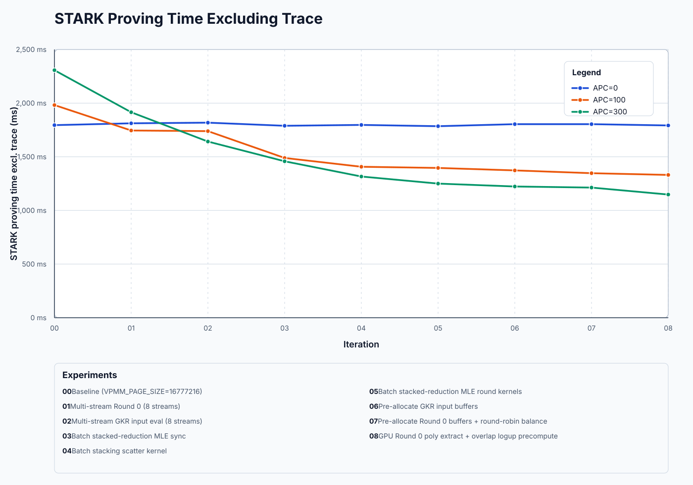

# AutoOpt 2026-04-12 (Clean Run)

This is a clean re-implementation of the `stark-backend` improvements found by [autoopt](https://github.com/georgwiese/autoopt) using [this context markdown files](https://gist.github.com/georgwiese/d68a67c583ecdfb3ffd0e448c657b68c).
Each improvement is in a separate commit, roughly sorted by their impact.

## Benchmark & problem statement

For this experiment, we looked into the [pairing guest program](https://github.com/powdr-labs/powdr/tree/openvm-v2-integration-07-04/openvm-riscv/guest-pairing) ([APC analyzer](https://powdr-labs.github.io/powdr/autoprecompile-analyzer/?data=https%3A%2F%2Fgist.githubusercontent.com%2Fleonardoalt%2F73b455213ef4f987bf330559b714cb65%2Fraw%2F521c6644ae3efa35d39b5e742520f9dddf2a7480%2Fapc_candidates_pairing_v2.json)).
In this guest program, applying autoprecompiles achieves significant reductions in the number of trace cells, constraint instances and bus interaction messages.

| Experiment             | Trace cells      | Constraint instances | Bus interaction messages |
|------------------------|------------------|----------------------|--------------------------|
| APC=0 (vanilla OpenVM) | 1.90B            | 1.13B                | 965.5M                   |
| APC=100                | 1.19B (1.60x ↓)  | 740.4M (1.52x ↓)      | 621.8M (1.55x ↓)         |
| APC=300                | 811.2M (2.35x ↓) | 505.2M (2.23x ↓)     | 448.5M (2.15x ↓)         |

However, this does not translate to a reduction in STARK proving time (excluding trace generation):
- For APC=100, the proving time is [up 1.10x](https://powdr-labs.github.io/powdr/openvm/metrics-viewer/?data=https%3A%2F%2Fgithub.com%2Fpowdr-labs%2Fstark-backend%2Fblob%2Fautoopt-2026-04-12-clean%2Fautoopt-clean-results%2Fstep-08-gpu-round0-overlap-logup%2Fcombined_metrics.json&baseline=baseline_apc000&run=baseline_apc100).
- For APC=300, the proving time is [up 1.28x](https://powdr-labs.github.io/powdr/openvm/metrics-viewer/?data=https%3A%2F%2Fgithub.com%2Fpowdr-labs%2Fstark-backend%2Fblob%2Fautoopt-2026-04-12-clean%2Fautoopt-clean-results%2Fstep-08-gpu-round0-overlap-logup%2Fcombined_metrics.json&baseline=baseline_apc000&run=baseline_apc300).

## Results

With the proposed changes, the trend reverses:



With all 8 optimizations applied, the STARK proving time excluding trace generation is:
- For APC=100, the proving time is [down 1.36x](https://powdr-labs.github.io/powdr/openvm/metrics-viewer/?data=https%3A%2F%2Fgithub.com%2Fpowdr-labs%2Fstark-backend%2Fblob%2Fautoopt-2026-04-12-clean%2Fautoopt-clean-results%2Fstep-08-gpu-round0-overlap-logup%2Fcombined_metrics.json&baseline=step-08-gpu-round0-overlap-logup_apc000&run=step-08-gpu-round0-overlap-logup_apc100).
- For APC=300, the proving time is [down 1.55x](https://powdr-labs.github.io/powdr/openvm/metrics-viewer/?data=https%3A%2F%2Fgithub.com%2Fpowdr-labs%2Fstark-backend%2Fblob%2Fautoopt-2026-04-12-clean%2Fautoopt-clean-results%2Fstep-08-gpu-round0-overlap-logup%2Fcombined_metrics.json&baseline=step-08-gpu-round0-overlap-logup_apc000&run=step-08-gpu-round0-overlap-logup_apc300).

While still not scaling linearly with the statistics above, the proposed prover changes lead to a significant reduction in proving time as we increase the number of autoprecompiles.

The metrics viewer links above show a more detailed breakdown of the proving time by phase. For example, the "LogUp GKR" phase goes down 1.99x for APC=300 vs APC=0, close to 2.15x reduction in bus interaction messages. On the other hand, the "MLE rounds" phase did not benefit for from the improvements and is still 1.63x slower for APC=300 vs APC=0.

## Overview of the changes

The following table summarizes the effect of the proposed changes, on STARK proving time (excluding trace generation):

| # | Change | Diffstat | APC 0 | vs base | vs prev | APC 100 | vs base | vs prev | APC 300 | vs base | vs prev |
|---|--------|----------|-------|---------|---------|---------|---------|---------|---------|---------|---------|
| 0 | Baseline (`VPMM_PAGE_SIZE=16777216`) | — | 1,819ms | — | — | 1,994ms | — | — | 2,331ms | — | — |
| 1 | Multi-stream Round 0 (8 streams) | +265/-140 | 1,807ms | -12ms<br>(1.01x ↓) | -12ms<br>(1.01x ↓) | 1,758ms | -236ms<br>(1.13x ↓) | -236ms<br>(1.13x ↓) | 1,914ms | -417ms<br>(1.22x ↓) | -417ms<br>(1.22x ↓) |
| 2 | Multi-stream GKR input eval (8 streams) | +184/-108 | 1,823ms | +4ms<br>(1.00x ↑) | +16ms<br>(1.01x ↑) | 1,610ms | -384ms<br>(1.24x ↓) | -148ms<br>(1.09x ↓) | 1,676ms | -655ms<br>(1.39x ↓) | -238ms<br>(1.14x ↓) |
| 3 | Batch stacked-reduction MLE sync | +22/-40 | 1,795ms | -24ms<br>(1.01x ↓) | -28ms<br>(1.02x ↓) | 1,510ms | -484ms<br>(1.32x ↓) | -100ms<br>(1.07x ↓) | 1,496ms | -835ms<br>(1.56x ↓) | -180ms<br>(1.12x ↓) |
| 4 | Batch stacking scatter kernel | +83/-32 | 1,806ms | -13ms<br>(1.01x ↓) | +11ms<br>(1.01x ↑) | 1,416ms | -578ms<br>(1.41x ↓) | -94ms<br>(1.07x ↓) | 1,301ms | -1,030ms<br>(1.79x ↓) | -195ms<br>(1.15x ↓) |
| 5 | Batch stacked-reduction MLE round kernels | +456/-49 | 1,799ms | -20ms<br>(1.01x ↓) | -7ms<br>(1.00x ↓) | 1,384ms | -610ms<br>(1.44x ↓) | -32ms<br>(1.02x ↓) | 1,254ms | -1,077ms<br>(1.86x ↓) | -47ms<br>(1.04x ↓) |
| 6 | Pre-allocate GKR input buffers | +93/-36 | 1,806ms | -13ms<br>(1.01x ↓) | +7ms<br>(1.00x ↑) | 1,389ms | -605ms<br>(1.44x ↓) | +5ms<br>(1.00x ↑) | 1,244ms | -1,087ms<br>(1.87x ↓) | -10ms<br>(1.01x ↓) |
| 7 | Pre-allocate Round 0 buffers + round-robin balance | +343/-42 | 1,804ms | -15ms<br>(1.01x ↓) | -2ms<br>(1.00x ↓) | 1,371ms | -623ms<br>(1.45x ↓) | -18ms<br>(1.01x ↓) | 1,222ms | -1,109ms<br>(1.91x ↓) | -22ms<br>(1.02x ↓) |
| 8 | GPU Round 0 poly extract + overlap logup precompute | +466/-134 | 1,808ms | -11ms<br>(1.01x ↓) | +4ms<br>(1.00x ↑) | 1,331ms | -663ms<br>(1.50x ↓) | -40ms<br>(1.03x ↓) | 1,166ms | -1,165ms<br>(2.00x ↓) | -56ms<br>(1.05x ↓) |

Each  change has a significant effect on STARK proving time, with each change being a reasonably-sized diff. The [full diff](https://github.com/powdr-labs/stark-backend/compare/v2-powdr-07-04...powdr-labs:stark-backend:1ca18279fa6f12d907d2c4bc7265eeaeda2025d7) is +1,732/-402 lines of code across 14 files.

See the [detailed reports](./detailed_reports.md) for more information on each change.

### Experimental setup

All experiments were run on an NVidea GeForce RTX 4090.
Also, we set `VPMM_PAGE_SIZE=16777216` for every run, including the baseline. This optimization was one of the items found by `autoopt`. It benefits all runs, including the baseline (1.19x faster).

### Noise

Each step is a single benchmark run. The original autoopt run characterized noise at roughly ±20 ms for APC 300 and ±15 ms for APC 0/100. APC 0 drifts in a ±25 ms band throughout steps 1-8; APC 0 uses the single-threaded path for Round 0 / GKR input eval (`<100` AIRs), so most of these changes are effectively no-ops for APC 0 and the small drifts vs baseline read as noise rather than a real effect.

## Future work

The agents didn't yet have access to the NSight Compute profiler (only NSight Systems). We're planning a new `autoopt`, to see if this helps the agents find more optimizations.

## Notes on the original run

See the [original `autoopt-2026-03-12` summary report](https://github.com/powdr-labs/stark-backend/blob/autoopt-2026-04-12/autoopt-results/summary-report.md) for all the changes that were tried. Note that the "Increase default VPMM page size 2 MiB -> 16 MiB" idea can also be implemented by setting `VPMM_PAGE_SIZE=16777216`, which is now part of the baseline.

## Update (2026-04-29): Measurements on synthetic benchmark

While we evaluated the changes on the pairing guest program, the effects can also be reproduced using `stark-backend`'s synthetic benchmark (see [stark-backend#318](https://github.com/openvm-org/stark-backend/pull/318)).

The following configuration is closest to the pairing guest program with APC=300:
```bash
VPMM_PAGE_SIZE=16777216 METRICS_OUTPUT=metrics.json \
cargo run -p openvm-benchmark-proving --release --features cuda -- \
    --num-airs 311 \
    --cols-per-air 171 \
    --constraints-per-col 0.5 \
    --interactions-per-col 0.6 \
    --log-rows-per-air 12
```

With this configuration, we have:
- 311 AIR instances (same as pairing APC=300 per segment)
- 311 x 171 = 53,181 columns (vs 53,421 for pairing APC=300 per segment)
- 53,181 x 0.5 = 26,590 constraints (vs 27,480 for pairing APC=300 per segment)
- 53,181 x 0.6 = 31,908 bus interactions (vs 33,678 for pairing APC=300 per segment)
- 53,181 x 2^12 = 217.8M trace cells (vs 224.2M for pairing APC=300 per segment)

The synthetic benchmark reproduces the qualitative finding: with all 8 optimizations applied, STARK proving time excluding trace generation drops from 673ms to 359ms — a 1.88x speedup, in line with the 2.00x measured for pairing APC=300 (2,331ms → 1,166ms).

| # | Change | Time | vs base | vs prev |
|---|--------|------|---------|---------|
| 0 | Baseline (`VPMM_PAGE_SIZE=16777216`) | 673ms | — | — |
| 1 | Multi-stream Round 0 (8 streams) | 592ms | -81ms<br>(1.14x ↓) | -81ms<br>(1.14x ↓) |
| 2 | Multi-stream GKR input eval (8 streams) | 557ms | -116ms<br>(1.21x ↓) | -35ms<br>(1.06x ↓) |
| 3 | Batch stacked-reduction MLE sync | 464ms | -209ms<br>(1.45x ↓) | -93ms<br>(1.20x ↓) |
| 4 | Batch stacking scatter kernel | 383ms | -290ms<br>(1.76x ↓) | -81ms<br>(1.21x ↓) |
| 5 | Batch stacked-reduction MLE round kernels | 358ms | -315ms<br>(1.88x ↓) | -25ms<br>(1.07x ↓) |
| 6 | Pre-allocate GKR input buffers | 360ms | -313ms<br>(1.87x ↓) | +2ms<br>(1.01x ↑) |
| 7 | Pre-allocate Round 0 buffers + round-robin balance | 358ms | -315ms<br>(1.88x ↓) | -2ms<br>(1.01x ↓) |
| 8 | GPU Round 0 poly extract + overlap logup precompute | 359ms | -314ms<br>(1.87x ↓) | +1ms<br>(1.00x ↑) |

Each row is the median of 3 measurement runs (with one warmup discarded). Inter-run variance was ~1-3 ms, so the +/-2 ms drifts in steps 6-8 read as noise rather than real regressions.

The per-component breakdown (median ms over 3 runs) localizes where each step paid off:

| Component | step 0 | step 1 | step 2 | step 3 | step 4 | step 5 | step 6 | step 7 | step 8 |
|---|---:|---:|---:|---:|---:|---:|---:|---:|---:|
| Constraints        | 319 | 238 | 202 | 203 | 204 | 202 | 204 | 202 | 202 |
| &nbsp;&nbsp;LogUp GKR        | 121 | 121 |  85 |  85 |  85 |  85 |  84 |  84 |  84 |
| &nbsp;&nbsp;Round 0          | 121 |  40 |  41 |  40 |  40 |  40 |  41 |  40 |  38 |
| &nbsp;&nbsp;MLE Rounds       |  76 |  76 |  76 |  77 |  77 |  76 |  77 |  76 |  78 |
| Openings           | 209 | 209 | 209 | 115 | 115 |  93 |  93 |  93 |  93 |
| &nbsp;&nbsp;WHIR             |  65 |  64 |  64 |  63 |  64 |  63 |  63 |  63 |  63 |
| &nbsp;&nbsp;Stacked Reduction| 143 | 144 | 145 |  51 |  51 |  29 |  29 |  29 |  29 |
| Trace Commit       | 144 | 143 | 142 | 144 |  62 |  62 |  62 |  62 |  62 |

Four components account for nearly all of the 314 ms speedup:
- **Stacked Reduction** (-114 ms): the largest single drop. Step 3 batches the previously per-window GPU pipeline drain, then step 5 batches the MLE round kernels themselves.
- **Round 0** (-83 ms): step 1 parallelizes the per-AIR work across 8 CUDA streams.
- **Trace Commit** (-82 ms): step 4 replaces per-column scatter calls with a single batched kernel.
- **LogUp GKR** (-37 ms): step 2 parallelizes GKR input evaluation across streams.

As with the pairing benchmark, steps 6-8 contribute very little on this configuration — they target buffer reuse and deeper overlap that pay off most when there is heterogeneity in AIR sizes (which the synthetic benchmark, with 311 identical AIRs, does not have).

Raw per-run measurements are in [`synthetic_results.csv`](./synthetic_results.csv).
