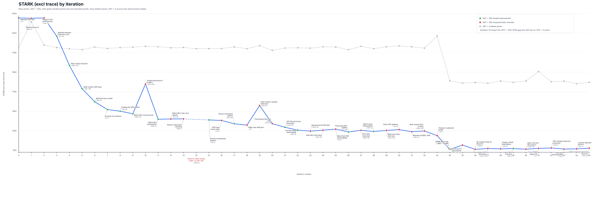

# AutoOpt Summary Report

## Final Outcome

- Completed run: **45 plotted experiments**, plus **2 additional off-loop side experiments**
- Landed: **16** changes
- Reverted: **29** plotted experiments, plus **2** off-loop side experiments
- Final stable branch state:
  - **APC 0:** **1796 ms** vs **2153 ms** baseline = **1.20x faster** (`-357 ms`)
  - **APC 100:** **1303 ms** vs **2155 ms** baseline = **1.65x faster** (`-852 ms`)
  - **APC 300:** **1118 ms** vs **2455 ms** baseline = **2.20x faster** (`-1337 ms`)
- Later reruns of the same late branch state stayed in a narrow band:
  - **APC 0:** `1782-1810 ms`
  - **APC 100:** `1295-1312 ms`
  - **APC 300:** `1110-1127 ms`
- Biggest durable win: **iteration 34 / `4863c316`**, raising the default VPMM page size from `2 MiB` to `16 MiB`
- Cheapest durable win: **iteration 7 / `0f6a9525`**, raising the stream count from `4` to `8` for **6 changed lines**

## Overall Pattern

1. **Allocator behavior mattered as much as kernel logic.** The biggest single win in the whole run was the VPMM page-size change, not another batching pass.
2. **The early wins came from deleting synchronization, launch, and allocation overhead while those costs were still dominant.**
3. **Round 0 and GKR were the highest-leverage phases.** Most later MLE/WHIR cleanups were real but smaller.
4. **APC 0 improved too, not just APC 300.** The late allocator changes especially helped every configuration, which is why the plot now carries the APC 0 series instead of only a flat reference line.

## Plot

Data file: [stark-excl-trace-by-iteration.csv](stark-excl-trace-by-iteration.csv)

Notes:

- The **blue series** is APC 300, with **green** landed points and **red** reverted points.
- The **gray dotted series** is APC 0 across the same branch states.
- **Iteration 14** has no APC 300 point because that task hit OOM before producing an APC 300 STARK metric.
- **Iteration 34** is the inserted VPMM page-size landing (`4863c316`), so the large late drop is represented as a real step in the series rather than an annotation.
- The CSV now carries `apc0_ms`, `apc100_ms`, and `apc300_ms`. `n/a` means that configuration was not measured in that task report.

## Landed Ideas

Baseline factors below use the canonical measurements from [baseline/summary.md](/Users/georg/coding/stark-backend/autoopt-results/baseline/summary.md). `n/a` means that configuration was not measured in that task report.

| Iteration | Commit | Idea | Main improvement | APC = 0 | APC = 100 | APC = 300 | Diffstat |
|-----------|--------|------|------------------|---------|-----------|-----------|----------|
| 3 | `b406a555` | Batch stacked-reduction MLE sync | Stacked Reduction `311 -> 126 ms` (`2.47x`) | `2152 ms (1.00x lower)` | `2055 ms (1.05x lower)` | `2268 ms (1.08x lower)` | `+22/-40` (62 lines) |
| 4 | `4e0bfa96` | Multi-stream Round 0 | Round 0 `662 -> 351 ms` (`1.89x`) | `2139 ms (1.01x lower)` | `1870 ms (1.15x lower)` | `1969 ms (1.25x lower)` | `+264/-140` (404 lines) |
| 5 | `f3345bd3` | Multi-stream GKR input eval | LogUp GKR `790 -> 564 ms` (`1.40x`) | `2131 ms (1.01x lower)` | `1986 ms (1.09x lower)` | `1730 ms (1.42x lower)` | `+184/-108` (292 lines) |
| 6 | `79314f3c` | Batch stacking scatter kernel | Trace Commit `406 -> 255 ms` (`1.59x`) | `2157 ms (1.00x higher)` | `1683 ms (1.28x lower)` | `1597 ms (1.54x lower)` | `+83/-32` (115 lines) |
| 7 | `0f6a9525` | Increase thread count `4 -> 8` | Round 0 `348 -> 295 ms` (`1.18x`) | `2143 ms (1.00x lower)` | `1848 ms (1.17x lower)` | `1517 ms (1.62x lower)` | `+3/-3` (6 lines) |
| 8 | `4d7b9dc0` | Pre-allocate GKR input buffers | GKR input eval `532 -> 318 ms` (`1.67x`) | `2152 ms (1.00x lower)` | `1632 ms (1.32x lower)` | `1501 ms (1.64x lower)` | `+93/-36` (129 lines) |
| 9 | `13bd3e96` | Batch MLE round kernels | Stacked Reduction `123 -> 75 ms` (`1.64x`) | `2156 ms (1.00x higher)` | `1591 ms (1.35x lower)` | `1474 ms (1.67x lower)` | `+456/-49` (505 lines) |
| 11 | `deda4f29` | Batch MLE interpolation | MLE Rounds `183 -> 168 ms` (`1.09x`) | `2160 ms (1.00x higher)` | `1589 ms (1.36x lower)` | `1418 ms (1.73x lower)` | `+238/-72` (310 lines) |
| 15 | `6b940845` | Round 0 interleaved work balance | Round 0 `313 -> 277 ms` (`1.13x`) | `2142 ms (1.01x lower)` | `1578 ms (1.37x lower)` | `1411 ms (1.74x lower)` | `+25/-5` (30 lines) |
| 17 | `e6f614f2` | Pre-allocate Round 0 buffers with threshold | Round 0 `276 -> 242 ms` (`1.14x`) | `2159 ms (1.00x higher)` | `n/a` | `1372 ms (1.79x lower)` | `+321/-40` (361 lines) |
| 21 | `423044cb` | GPU-side Round 0 polynomial extraction | Round 0 `245 -> 202 ms` (`1.21x`) | `2147 ms (1.00x lower)` | `n/a` | `1336 ms (1.84x lower)` | `+373/-101` (474 lines) |
| 22 | `21c878af` | Overlap logup precompute with Round 0 | STARK `1370 -> 1306 ms` (`1.05x`); LogUp GKR `570 -> 526 ms` (`1.08x`) | `2150 ms (1.00x lower)` | `n/a` | `1306 ms (1.88x lower)` | `+94/-34` (128 lines) |
| 26 | `a36c3986` | Ping-pong MLE fold buffers | MLE Rounds `171 -> 161 ms` (`1.06x`) | `2130 ms (1.01x lower)` | `n/a` | `1288 ms (1.91x lower)` | `+177/-38` (215 lines) |
| 28 | `49251f4e` | Matrix-base pointer interpolation | MLE Rounds `163 -> 159 ms` (`1.03x`) | `2141 ms (1.01x lower)` | `n/a` | `1293 ms (1.90x lower)` | `+159/-22` (181 lines) |
| 34 | `4863c316` | Increase default VPMM page size `2 MiB -> 16 MiB` | STARK `1296 -> 1110 ms` (`1.17x`); LogUp GKR `534 -> 359 ms` (`1.49x`) | `1811 ms (1.19x lower)` | `1298 ms (1.66x lower)` | `1110 ms (2.21x lower)` | `+9/-1` (10 lines) |
| 39 | `cad1ec2d` | Hoist MLE TraceCtx construction | MLE Rounds `166 -> 162 ms avg` (`1.02x`) | `1796 ms (1.20x lower)` | `1303 ms (1.65x lower)` | `1118 ms (2.20x lower)` | `+36/-2` (38 lines) |

## Recommended Changes

Dependency-safe order, not pure impact ranking: every item below is either independent or has its prerequisites included earlier in the same list.

| Order | Iteration | Commit | Change | Why it belongs here |
|-------|-----------|--------|--------|---------------------|
| 1 | 34 | `4863c316` | Increase default VPMM page size `2 MiB -> 16 MiB` | Independent allocator change; biggest cross-APC win in the run for only **10 changed lines**. |
| 2 | 3 | `b406a555` | Batch stacked-reduction MLE sync | Independent and high-payoff per line: **`-192 ms` APC 300** for **62 lines**. |
| 3 | 6 | `79314f3c` | Batch stacking scatter kernel | Independent Trace Commit win with a moderate diff and strong end-to-end payoff. |
| 4 | 4 | `4e0bfa96` | Multi-stream Round 0 | Foundation for later Round 0 follow-ons (`7`, `17`, `22`). |
| 5 | 5 | `f3345bd3` | Multi-stream GKR input eval | Foundation for later GKR follow-ons (`7`, `8`). |
| 6 | 7 | `0f6a9525` | Increase thread count `4 -> 8` | Tiny diff, but only makes sense once the multi-stream paths from `4` and `5` exist. |
| 7 | 8 | `4d7b9dc0` | Pre-allocate GKR input buffers | Builds on the multi-stream GKR worker design from `5`; safest after the stream-count increase. |
| 8 | 17 | `e6f614f2` | Pre-allocate Round 0 buffers with threshold | Builds on the multi-stream Round 0 worker design from `4` and keeps the Round 0 chain self-contained. |
| 9 | 22 | `21c878af` | Overlap logup precompute with Round 0 | Depends on the existing multi-threaded Round 0 path, so it belongs after that Round 0 chain. |

After these, the remaining landed changes were still worth keeping, but they were either later-stage cleanups with smaller payoff (`26`, `28`, `39`) or larger implementations with a weaker payoff ratio (`9`, `11`, `21`).

## What Did Not Pay Off

- **Round 0 batching never produced a durable landing.** Iterations `13`, `14`, `36`, and the off-loop `2026-04-15-1130` task hit illegal-address bugs, rebuild-triggered OOM, or kernel hangs.
- **CUDA pool state was highly sensitive.** Prewarming the codeword buffer and shrinking the VPMM page size back to `8 MiB` both hurt APC 0 / GKR badly even when the targeted phase looked better.
- **Most late batching ideas were technically correct but economically weak.** Once a phase was already down around `70-180 ms`, removing another few hundred launches usually saved only `2-10 ms` at STARK level.
