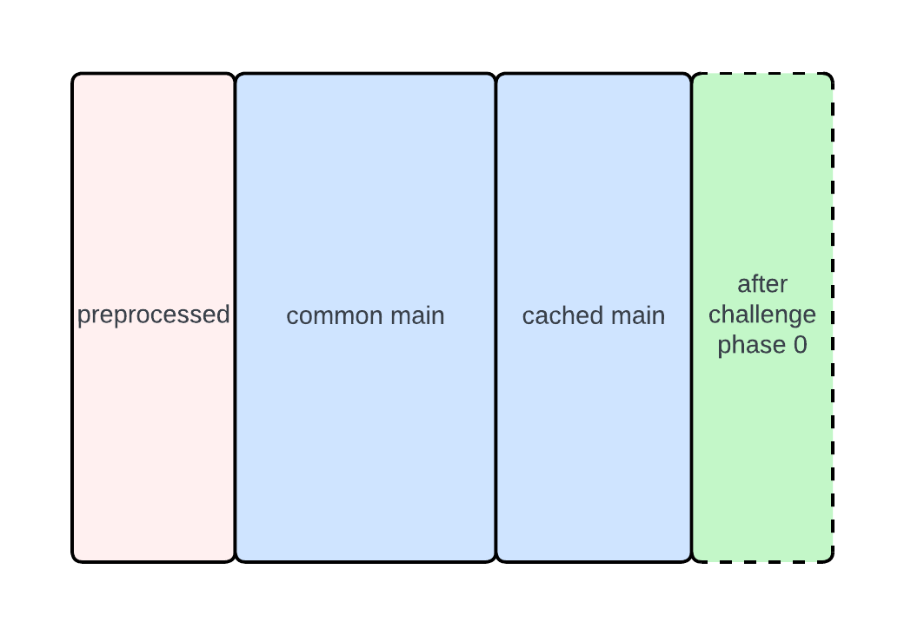
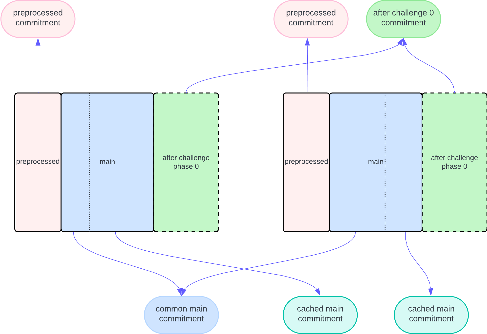

# STARK Backend

The backend is a low-level API built on top of Plonky3. Its goal is to prove multiple STARKs presented in the form of multiple [RAPs](#raps) and their trace matrices.
The backend is not intended to own trace generation, with some caveats (see Interactive AIRs below).

The backend supports RAPs with one round of interactions, the round being used for synchronizing elements between different AIRs (see below). [This](https://hackmd.io/@aztec-network/plonk-arithmetiization-air) can be used as a reference for the definition of AIRs and related concepts.

## Table of Contents

1. [Definitions](#definitions)
2. [Traces as polynomials](#traces-as-polynomials)
3. [The Protocol](#the-protocol)
4. [Proving Key](#proving-key)
5. [Verifying Key](#verifying-key)

## Definitions

Everywhere below we assume that all elements we are dealing with are in a field $\mathbb{F}$ or its extension fields.

### AIRs

The following is a vague definition of an AIR; there is a [more general definition](https://eprint.iacr.org/2021/582.pdf), which is not fully supported by this backend and has some parts which overload the definition and will be assumed implicitly whenever needed.

An **AIR** is a set of pairs $(C_i, H_i)$, where $C_i\colon \mathbb{F}^{2w} \to \mathbb{F}$ is a _constraint polynomial_. Here $w$ is the width associated with the AIR; the trace matrix of the AIR must be of width $w$. $H_i$ can be one of `All`, `First`, `Last`, `Transition`. If $(x_1, \ldots, x_w, y_1, \ldots, y_w)$ are two cyclically consecutive rows of the trace matrix, then each such pair constrains $C_i(x_1, \ldots, x_w, y_1, \ldots, y_w)$ to be zero; with the following domains:
- If $H_i$ is `All`, then this applies to all pairs of cyclically consecutive rows.
- If $H_i$ is `First`, then this applies to the first pair of cyclically consecutive rows.
- If $H_i$ is `Last`, then this applies to the pair (last row, first row).
- If $H_i$ is `Transition`, then this applies to all pairs of non-cyclically consecutive rows (that is, like `All` but except (last, first)).

In general it is possible to support more domains, but our backend supports only the above.

An AIR only supports trace matrices whose height is a power of two (or zero-height matrices, which get skipped).

### PAIRs

**PAIR** (Preprocessed AIR) is an AIR with $t$ fixed columns. The fixed columns are preprocessed and fixed at keygen time.

In general, hereafter by PAIR we will mean any AIR with $t$ fixed columns, even if $t = 0$. However, there is an important restriction: if there is at least one fixed column, it implies that the trace height is fixed as well. However, if $t = 0$, the only restriction is that the trace height is a power of two.

### RAPs

As mentioned above, AIR does not own trace generation, with some caveats. In **RAPs** (Randomized AIR with Preprocessing), the following happens:
- Some part of the trace is generated -- namely, it consists of the following subparts:
  - `preprocessed` is a fixed part of the trace that is preprocessed and fixed at keygen time. It can be omitted. These columns do not depend on the inputs. If an AIR has preprocessed trace, its height is fixed at keygen time. If an AIR does not have preprocessed trace, the trace height can vary at proof time but must be a power of two.
  - `main` is the main part of the trace that is processed at proof time. We partition it into _two_ parts: "common main", which all have the common commitment, and "cached main", which are committed separately.
- Based on all these parts, pseudo-random extension field elements are generated by both prover and verifier via [Fiat-Shamir heuristic](https://en.wikipedia.org/wiki/Fiat%E2%80%93Shamir_heuristic) (the extension degree is fixed within the protocol and is correlated to the security parameters).
- The prover adds more columns to the trace, based on these random elements.

In our backend, only one phase of such interaction is supported. More specifically, the RAP also has a set of pairs $(\mathrm{bus}, I_j, M_j)$, where $\mathrm{bus}\in\mathbb{F}\setminus\{0\}$ is a bus index, $I_j\in\mathbb{F}[x_1, \ldots, x_w, y_1, \ldots, y_w]^{\ell}$ is a sequence of polynomials, and $M_j\in\mathbb{F}[x_1, \ldots, x_w, y_1, \ldots, y_w]$ is a multiplicity polynomial. The constraints are that for every different pair $(\mathrm{bus}, I_j(x_1, \ldots, x_w, y_1, \ldots, y_w))$ the sum of all multiplicities $M_j(x_1, \ldots, x_w, y_1, \ldots, y_w)$ over all AIRs must be zero. See [Interactions API](./interactions.md) for more details.

Therefore, the final trace matrix will look like this:



## Traces as polynomials

Consider a trace matrix $\mathbf{T}$ of height $h$ and width $w$, and an AIR of width $w$.

Let $\omega$ be an $h$-th root of unity in $\mathbb{F}$, fixed uniquely (so a generator $g$ of $\mathbb{F}$ is also an implicit part of an AIR, and $\omega = g^{(p-1)/h}$). Then each trace column $T_i$ is initially viewed as a polynomial (of degree at most $h - 1$) whose values at powers of $\omega$ are the trace column's values.
Therefore, each constraint polynomial $C_i$, applied to the rows $i$ and $i+1$, constrains that $C_i(T_1(\omega^i), \ldots, T_w(\omega^i), T_1(\omega^{i+1}), \ldots, T_w(\omega^{i+1})) = 0$.
Replacing $\omega^i$ by $x$, we obtain that this constrains the equality $C_i(T_1(x), \ldots, T_w(x), T_1(\omega x), \ldots, T_w(\omega x)) = 0$, which is actually a univariate polynomial $\mathbf{C}_i(x)$.
If $H_i$ is `All`, then this is a constraint that $\mathbf{C}_i(x)$ is zero for all $x = \omega^j$. If $H_i$ is `Transition`, then this is a constraint $\mathbf{C}_i(x)\cdot(x - \omega^{h-1}) = 0$ for all such $x$. The other two cases are similar.

To show that some polynomial $P(x)$ is zero at all powers of $\omega$, we first compute its **quotient polynomial**: statements "polynomial $P(x)$ is zero at all $h$-th roots of unity" is equivalent to "polynomial $P(x)$ is divisible by $x^h - 1$", which is equivalent to "The rational function $P(x) / (x^h - 1)$ is a polynomial". This rational function is called "the quotient polynomial", and to prove that it is indeed a polynomial (of a bounded degree), we use the [FRI protocol](https://www.semanticscholar.org/paper/Fast-Reed-Solomon-Interactive-Oracle-Proofs-of-Ben-Sasson-Bentov/2415603b4e8799f575b788706be21862c055e25b).

## The Protocol

### In Summary

Below is the illustration of what is committed in the protocol.



The overall order is as follows:

1. **Commit (Pre-Challenge):**  
   a. Compute common main trace commitment.  
   b. Gather cached main trace commitments and combine them with the common main commitment.

2. **Challenger Observations (Before RAP):**  
   a. Observe the public values per AIR.  
   b. Observe preprocessed commitments (from the verifying key view).  
   c. Observe the main trace commitments.  
   d. Observe the trace domain sizes (log trace heights).

3. **After-Challenge Phase Processing:**  
   a. Run the partial RAP phase proving routine via the device, which produces additional (after-challenge) commitments.  
   b. Observe these extra RAP commitments.

4. **Quotient Commitment:**  
   a. Evaluate and commit to the quotient polynomial.  
   b. Observe the resulting quotient commitment.

5. **Opening:**  
   a. Open all polynomial commitments to produce the final opening proof.

6. **Final Proof Assembly:**  
   a. Bundle all commitments, opening proofs, and per-AIR data into the final proof structure.

Below we describe each step in detail.

### Pre-Challenge Commitments

The prover first commits to the main trace parts before any challenges are issued. All common mains are committed together into a single commitment, and the cached mains are committed separately.

### Challenger Observations (Before RAP Phases)

Before any RAP (after-challenge) commitments are generated, the challenger (a prover+verifier's entity generating randomness non-interactively via Fiat-Shamir heuristic) observes all public information:
- **Public values** for each AIR,
- **Preprocessed trace commitments** extracted from the verifying key view,
- **Main trace commitments** from step 1,
- **Trace domain sizes** (computed as the log of the trace heights).

```rust
// Observe public values:
for pvs in &pvs_per_air {
    self.challenger.observe_slice(pvs);
}

// Observes preprocessed and main commitments:
let mvk = mpk.vk_view();
let preprocessed_commits = mvk.flattened_preprocessed_commits();
self.challenger.observe_slice(&preprocessed_commits);
self.challenger.observe_slice(&main_trace_commitments);

// Observe trace domain size per AIR:
self.challenger.observe_slice(
    &log_trace_height_per_air
        .iter()
        .copied()
        .map(Val::<SC>::from_canonical_u8)
        .collect_vec(),
);
```

These observations lock in the public values and commitments.

### After-Challenge Phase Commitments

In the interaction phase, the prover processes additional data based on new challenges. The device generates extra commitments (for the "after-challenge" trace) by calling `partially_prove()`. As soon as these commitments are produced, they are observed by the challenger.

```rust
let (rap_partial_proof, prover_data_after) = self.device.partially_prove(
    &mut self.challenger,
    &mpk.per_air,
    pair_trace_view_per_air,
);
// Challenger observes additional commitments if any exist:
for (commit, _) in &prover_data_after.committed_pcs_data_per_phase {
    self.challenger.observe(commit.clone());
}
```

This ensures that the extra RAP phase commitments are immediately committed to before any further steps.

### Quotient Polynomial Commitment

After handling the After-Challenge phase, the prover evaluates and commits to the quotient polynomial. The final quotient commitment is stored as part of the overall commitments in the proof.

The structure for commitments is defined as follows:

```rust
pub struct Commitments<Com> {
    /// Multiple commitments for the main trace.
    pub main_trace: Vec<Com>,
    /// One shared commitment for all trace matrices (after challenge assignments).
    pub after_challenge: Vec<Com>,
    /// Shared commitment for all quotient polynomial evaluations.
    pub quotient: Com,
}
```

The quotient commitment is observed immediately after it is produced so that the final proof has all the necessary publicly verifiable commitments.

### Polynomial Opening Proof

Once all commitments (main, RAP phases, and quotient) are generated, the prover produces opening proofs for the committed polynomials. These opening proofs demonstrate correctness by revealing evaluations at specific points while still preserving secrecy of the entire polynomial. We use the [FRI protocol](https://www.semanticscholar.org/paper/Fast-Reed-Solomon-Interactive-Oracle-Proofs-of-Ben-Sasson-Bentov/2415603b4e8799f575b788706be21862c055e25b) as the polynomial commitment scheme via [Plonky3](https://github.com/Plonky3/Plonky3)'s implementation.

The final proof structure includes this opening proof:

```rust
pub struct Proof<SC: StarkGenericConfig> {
    pub commitments: Commitments<Com<SC>>,
    pub opening: OpeningProof<PcsProof<SC>, SC::Challenge>,
    pub per_air: Vec<AirProofData<Val<SC>, SC::Challenge>>,
    pub rap_phase_seq_proof: Option<RapPhaseSeqPartialProof<SC>>,
}
```

### Final Assembly of the Proof

In the final step, the proof is assembled by bundling:
- All the commitments (main trace, after-challenge, and quotient),
- The opening proof for those commitments,
- And additional per-AIR data (e.g., exposed values to ensure that the challenges were passed correctly and trace degrees).

This assembled object is then returned as the final proof—ready to be verified by replaying the challenge process.

The `Proof` struct (shown above) is the final container that encapsulates all parts of the protocol.


Below we show, in structure, the contents of the proving key and verifying key.

## Proving Key

The proving key (often represented by the type `StarkProvingKey` and collected into a `MultiStarkProvingKey`) contains, for each AIR:

- **Air Identifier**  
  A human‐readable name (e.g. `air_name`) for display and debugging.

- **Prover-Only Data**  
  - **Preprocessed Trace Data:**  
    Located in the field named (for example) `preprocessed_data` of type `Option<ProverOnlySinglePreprocessedData>`. This contains the information regarding the preprocessed traces that is necessary to compute commitments.
  - **RAP Partial Proving Key:**  
    The field `rap_partial_pk` holds additional information needed for the interactive (or partially interactive) phase of the protocol. In particular, this may contain predefined information about how to chunk interactions.

- **Verifying Key Portion (`vk`)**  
  See below.

## Verifying Key

The verifying key (often represented by the type `StarkVerifyingKey`, and then collected into a `MultiStarkVerifyingKey`) is derived solely from the public portion of the proving key. For each AIR it contains:

- **Preprocessed Commitment (Public View):**  
  If the AIR had a preprocessed trace, then a commitment to that trace is stored (wrapped in a `VerifierSinglePreprocessedData` structure) rather than the raw trace data.

- **Public AIR Parameters:**  
  This includes all the static configuration details such as the trace widths and the number of public values. These allow the verifier to know the structure of the proof system and the expected sizes of various objects.

- **Symbolic Constraints:**  
  These constraints define the AIR. They are stored in the form of DAG.
  Symbolic interactions are also stored separately in the verifying key.

- **Quotient Degree and Challenge Phase Information:**  
  This tells the verifier what degree to expect for the quotient polynomial and the challenge phase related information.

